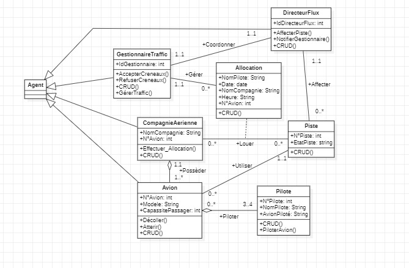

# Système Multi-Agent (SMA) de Contrôle Aérien

Ce projet est une application complète d'un Système Multi-Agent (SMA) pour le contrôle aérien, développé dans le cadre du programme Master IA et Science de Données à l'Université Abdelmalek Essaadi. Le système est conçu pour optimiser la gestion du trafic aérien, réduire la congestion et améliorer la sécurité et l'efficacité.

## Table des Matières
1. [Introduction](#introduction)
2. [Problématique](#problématique)
3. [Objectif du Projet](#objectif-du-projet)
4. [Architecture du Système](#architecture-du-système)
5. [Conception](#conception)
6. [Implémentation](#implémentation)
7. [Installation](#installation)
8. [Les interfaces de l'application](#Les-interfaces-de-l'application)
9. [Outils Utilisés](#outils-utilisés)
10. [Conclusion](#conclusion)
11. [Références](#références)

## Introduction
Le contrôle aérien est crucial pour assurer la sécurité et l'efficacité dans le ciel. Avec le nombre croissant de vols, gérer le trafic aérien de manière efficace est devenu un défi important. Ce projet explore l'utilisation d'un Système Multi-Agent (SMA) pour optimiser la gestion du trafic aérien en utilisant la plateforme JADE (Java Agent DEvelopment Framework).

## Problématique
Le principal problème abordé par ce projet est la congestion du trafic aérien. L'augmentation du volume de trafic aérien, la capacité limitée des infrastructures et le besoin d'une gestion efficace du trafic sont des défis clés. Ce projet vise à explorer des stratégies et des technologies pour optimiser la coordination et l'efficacité du contrôle aérien.

## Objectif du Projet
L'objectif principal de ce projet est de développer et d'implémenter un système multi-agent sophistiqué capable de gérer de manière dynamique et efficace les interactions et les mouvements des avions dans les aéroports et pendant les phases de vol.

## Architecture du Système
Le SMA pour la gestion du trafic aérien comprend plusieurs agents spécifiques, chacun jouant un rôle crucial pour assurer le flux fluide et sécurisé du trafic aérien :
- **Agent Avion** : Gère les paramètres de vol tels que la vitesse, l'altitude et la position.
- **Agent Pilote** : Simule la prise de décision humaine nécessaire pour piloter l'avion.
- **Agent Gestionnaire de Trafic** : Surveille et gère les mouvements des avions dans un espace aérien ou un secteur d'aéroport spécifique.
- **Agent Compagnie Aérienne** : Représente les intérêts opérationnels et commerciaux d'une compagnie aérienne.
- **Agent Directeur de Flux** : Optimise le flux de trafic à une plus grande échelle, coordonnant les mouvements entre différents secteurs.

## Conception
### Diagramme de Cas d'Utilisation
Le diagramme de cas d'utilisation fournit une représentation visuelle des interactions entre les acteurs (utilisateurs ou autres systèmes) et le système de contrôle aérien basé sur le SMA.


### Diagramme de Classes
Le diagramme de classes offre une représentation détaillée des entités du système et de leurs relations, y compris les classes clés telles que Gestionnaire de Trafic, Compagnie Aérienne, Directeur de Flux, Avion, Pilote, Piste, et Allocation.


### Diagrammes de Séquence
Les diagrammes de séquence illustrent les interactions dynamiques entre les agents et les processus au sein du SMA pour la gestion du trafic aérien. Les processus clés incluent :
- **Allocation de Piste** : Étapes impliquées dans l'allocation des pistes pour le décollage et l'atterrissage.
- **Demandes d'Atterrissage et de Décollage** : Interactions pour traiter les demandes d'atterrissage et de décollage.


### Diagrammes de Transition d'État
Les diagrammes de transition d'état représentent les changements d'état du système ou d'un agent en réponse à des événements, montrant les flux de travail et les conditions nécessaires pour les transitions d'état.


## Implémentation
### Structure du Projet
Le projet est structuré en utilisant IntelliJ IDEA et comprend plusieurs composants clés :
- **JADE** : Cadre de développement d'agents en Java pour créer et gérer les agents.
- **JavaFX** : Pour créer des interfaces utilisateur graphiques.
- **MySQL** : Base de données pour gérer les informations d'allocation et de statut.
- **XAMPP** : Pour gérer le serveur de base de données.
### Installation

- Clonez le dépôt:
```
git clone https://github.com/amine-sabbahi/Application-SMA-pour-le-controle-aerien.git
```

### Exécution du Projet
Pour exécuter le projet :
1. Configurer la plateforme JADE.
2. Configurer la base de données MySQL.
3. Utiliser IntelliJ IDEA pour compiler et exécuter le projet.
4. Interagir avec le système via les interfaces basées sur JavaFX.

## Les interfaces de l'application
### Plateforme JADE
Tout d'abord en lance le conteneur principal.  Ce  conteneur principal  abrite trois  agents principaux  essentiels  :  DF  (Directory  Facilitator),  responsable  de  la  gestion  des  services  disponibles,  AMS  (Agent Management System), chargé de la gestion des agents et de leur cycle de vie et RMA (Remote Monitoring Agent),  fournissant des fonctionnalités de surveillance et de diagnostic.


### Interface Avion
Interagit avec le Directeur Flux pour obtenir des informations sur les pistes.


### Interface Compagnie Aerienne
Demande des créneaux de vol pour ses avions, reçoit des confirmations de créneaux ou des alternatives en cas de conflit.


### Interface  Directeur  Flux
Gère  les  demandes  de  pistes  et  coordonne  les mouvements au atterrissage et les décollages.


### Interface Gestionnaire Trafic 
Supervise la distribution des créneaux de vol, surveille le flux de trafic, et ajuste les plans en fonction des besoins.


### Base données utilisé
Dans  notre  système  de  gestion  de  trafic  aérien,  une  base  de  données  MySQL intitulée Allocation a été créée pour assurer un suivi rigoureux des réservations et des allocations de créneaux pour les avions.


## Outils Utilisés
- **JADE** : Plateforme pour développer des systèmes basés sur des agents.
- **JavaFX** : Framework pour créer des interfaces utilisateur.
- **IntelliJ IDEA** : Environnement de développement intégré pour le développement Java.
- **StarUML** : Outil pour créer des diagrammes UML.
- **MySQL** : Système de gestion de base de données.
- **XAMPP** : Ensemble de logiciels pour le développement web.

## Conclusion
Ce projet démontre le potentiel des systèmes multi-agents dans l'optimisation de la gestion du trafic aérien. En tirant parti de la robustesse de la plateforme JADE et de la flexibilité de JavaFX, le projet vise à réduire les retards, améliorer la sécurité et renforcer l'efficacité globale des opérations aéroportuaires.

## Références
Pour des références détaillées, veuillez consulter la documentation du projet.

### Contributeurs
- **[Mahri Aymane](https://github.com/AymaneM21)**
- **[Sabbahi Mohamed Amine](https://github.com/amine-sabbahi)**

---

**Université Abdelmalek Essaadi** Faculté des Sciences et Techniques Tanger
 - Département : Génie Informatique
 - Année Académique : 2023/2024
 - Master : IA & DS
 - Module : Système Multi-Agents (SMA)
 - Encadré par : **Pr. El Mokhtar EN-NAIMI**